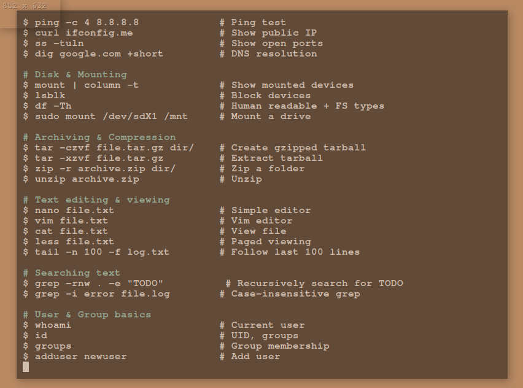

# runes

_Visual noise with purpose._

A transparent, terminal-based cheat sheet scroller with a styled Alacritty HUD.

## Preview




## Features

- Alacritty-powered floating terminal UI
- Modular cheat sheet library (git, vim, docker, etc.)
- Borderless and windowed launcher modes

## Installation

```bash
git clone https://github.com/terminal-runes/runes.git
cd runes
chmod +x install.sh
./install.sh
```

After install, the following launchers are available:

- `runes` – launches borderless HUD with default sheet
- `runes-windowed` – launches in a movable window
- `runes-browse` – lets you select a sheet interactively

Add `~/.local/bin` to your PATH if needed:

```bash
echo 'export PATH="$HOME/.local/bin:$PATH"' >> ~/.bashrc
source ~/.bashrc
```

## Usage

```bash
runes sheets/default.txt
runes sheets/vim_shortcuts.txt
runes-windowed sheets/docker_cmds.txt
runes-browse
```

The `runes-browse` script will:

- Ask if you want windowed or borderless mode
- Let you pick a sheet using `fzf` (or fallback menu)

All launchers use `nohup` to run Alacritty in the background.

## Requirements

- `alacritty` installed and available in `$PATH`

## Moving the window

Borderless mode removes all decorations. Use your window manager's move shortcut:

- **Alt + Drag** (X11)
- **Super + Drag** (KDE, GNOME)
- **Alt + F7** (XFCE)

Use `runes-windowed` if you're not sure.

## Will it work with other desktops?

Yes. Runes uses Alacritty and doesn’t rely on any specific desktop environment. It works with:

- XFCE, GNOME, KDE
- i3, bspwm, sway, etc.

If you're using Wayland (e.g. GNOME/KDE), some setups may not let you move borderless windows. Use `runes-windowed` in that case.

## Security

Runes will refuse to load any file that isn't detected as plain text.
This helps prevent abuse through malformed or malicious files.

That said, you're still responsible for what lives in your `sheets/` folder.
Review content before adding it. Don't assume `.txt` means safe.

## Customize

Cheat sheets live in `sheets/*.txt`. Format is plain text, organized with headings and prefix symbols:

- `#` for section headers
- `$` for commands
- `>` for tips/comments

Default styling is configured in `config/alacritty/alacritty.toml`.

## Contribute

- Fork the project
- Add new `.txt` sheets to `sheets/`
- Keep entries short, focused, and relevant to terminal workflows

---

MIT licensed.
